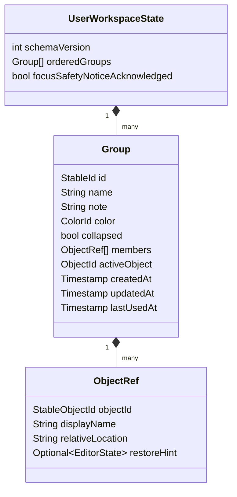
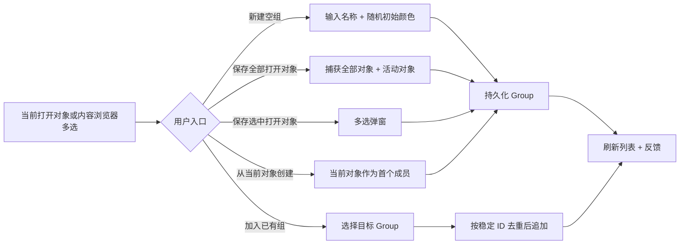
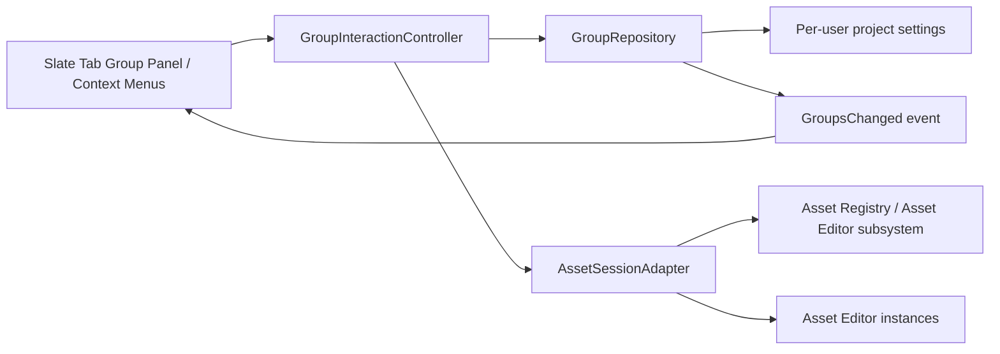

# Tab Group 管理交互设计与跨系统迁移指南

> 本文把 IdeaTabManager 当前已经实现的 Group 管理交互提炼为可迁移的产品与工程设计。目标系统可以是 Unreal Editor 的“打开资产工作组”，也可以是任何具有“可打开对象 + 用户工作上下文”的桌面工具。
>
> 读者应将“**已实现事实**”视为当前插件的行为契约；将“**UE 适配建议**”视为迁移时需要结合目标 UE 版本和编辑器架构落地的建议，而不是当前插件已实现的 UE 功能。

## 1. 设计目标与边界

### 1.1 要解决的问题

用户在一个长期任务中通常会同时打开一组互相关联的对象：例如一个玩法功能涉及 C++、蓝图、动画和数据表；在 UE 中则可能涉及 Character Blueprint、Anim Blueprint、Montage、Data Asset 与关卡中的若干资产。原生 Tab 只描述“此刻打开了什么”，无法表达“这些对象属于同一个待继续的工作上下文”。

Tab Group 的职责是让用户能够：

1. 保存一组对象及其主对象；
2. 给这组对象命名、添加说明、颜色和显示顺序；
3. 之后一键恢复这组上下文；
4. 从多个入口把对象加入已有组；
5. 在需要时显式收敛工作区，但不会静默关闭有风险的内容。

### 1.2 三条不可变的产品原则

| 原则 | 当前实现 | 迁移时必须保留的原因 |
| --- | --- | --- |
| Group 是用户工作上下文，不是当前 Tab 的镜像 | 关闭编辑器 Tab 不会反向删除 Group 成员；只有显式“更新”或“移除”才改成员。 | 用户应能关闭窗口、重启工具并重新恢复上下文。 |
| 成员可属于多个 Group | 每个 Group 内按稳定对象标识去重，但不同 Group 可以引用同一对象。 | 公共资产/公共文件常同时服务多个功能；“移动”语义会意外破坏另一个上下文。 |
| 默认恢复非破坏性 | `Open Group` 只补开并聚焦目标，不关闭其他 Tab。 | 日常切换必须安全、可预期，不能丢失未保存工作。 |

当前模型和去重逻辑见 [TabGroupRecord.kt](../src/main/kotlin/com/whalesea/ideatabmanager/model/TabGroupRecord.kt)、[TabReference.kt](../src/main/kotlin/com/whalesea/ideatabmanager/model/TabReference.kt) 与 `TabGroupProjectState.distinctReferences`。

## 2. 心智模型与数据契约

### 2.1 核心实体



当前插件的实际字段为：

| 概念 | 当前字段 | 交互用途 |
| --- | --- | --- |
| 稳定 Group ID | `TabGroupRecord.id` | 编辑、排序、删除时不依赖可变标题。 |
| 标题与注释 | `name`、`comment` | 标题用于快速识别；注释记录任务意图或下一步。 |
| 颜色 | `colorId` | 仅作为识别线索，不承载业务状态。 |
| 展开状态 | `isCollapsed` | 让长列表保持可扫描；属于用户 UI 偏好，应持久化。 |
| 成员与主对象 | `tabs`、`activeFileUrl` | 恢复时先打开成员，再聚焦主对象。 |
| 生命周期/最近使用 | `createdAtEpochMs`、`updatedAtEpochMs`、`lastUsedAtEpochMs` | 支持最近使用组、排序诊断和以后扩展。 |
| 关闭审查 | 运行时计算组外已保存对象 | 安全入口由用户逐项选择；Unsafe 入口每次都明确警告。 |

对象引用必须存储**稳定 ID**，不能只存显示名。当前插件使用 `fileUrl`；UE 迁移建议使用能在编辑器重启后重新解析的资产路径（例如由适配层维护的 `FSoftObjectPath` 字符串或等价资产标识），并将显示名、目录和可选恢复提示作为冗余展示数据。

### 2.2 持久化范围

当前 Group 状态存入项目私有的 `workspace.xml`，因此默认是“同一项目、同一用户”的工作习惯，不是应提交到版本库的团队配置。对应实现见 [TabGroupProjectState.kt](../src/main/kotlin/com/whalesea/ideatabmanager/service/TabGroupProjectState.kt) 的 `@State` 声明。

UE 迁移时应做出明确选择：

- **推荐默认值：项目内、用户私有。** 保存到 Editor Per-Project User Settings / `GEditorPerProjectIni` 等用户配置位置，不提交到源码管理。
- **可选共享模式：显式导出/导入。** 用 JSON 或 Data Asset 作为单独功能，并标明其中的资产引用会受重命名、插件缺失和分支差异影响。
- 不应把用户临时打开的 Group 直接写进关卡、蓝图或资产本体；这会制造不必要的提交噪声与多人冲突。

## 3. 当前交互面与信息层级

### 3.1 主入口：专属 Group 面板

当前插件不接管原生 Editor Tab 栏，而是在 `Tab Groups` Tool Window 中展示 Group 列表。这样能保留宿主原有的 Tab 行为，同时给 Group 更多纵向空间承载标题、注释、成员和菜单。

顶部工具栏提供三个创建入口：

| 入口 | 用户动作 | 结果 |
| --- | --- | --- |
| `Undo Last Group Action` | 点击工具栏 Undo | 单步撤销最近一次 Group 创建或 Group 打开/组外关闭动作。 |
| `Create Empty Group` | 仅输入名称 | 新建空 Group，适合先规划再收集对象。 |
| `Save All Tabs` | 输入名称 | 捕获全部已打开对象以及当前主对象。 |
| `Save Selected Tabs` | 在多选弹窗勾选对象 | 创建新 Group，或将所选对象加入一个已有 Group。 |

`Save Selected Tabs` 使用一次性模态选择表，而不是把大量打开对象长期铺在主面板。弹窗默认选择当前活动对象，并提供 `Select All` / `Clear`。对象按所有打开文件父目录的最长公共路径组织为可折叠树；根目录不强制使用项目根目录，跨盘符/无公共目录时使用 `Open Files` 虚拟根。文件夹复选框可选中整棵子树，文件行仍可单独选择，避免同名对象误选。对应实现见 [OpenTabsSelectionDialog.kt](../src/main/kotlin/com/whalesea/ideatabmanager/toolwindow/OpenTabsSelectionDialog.kt)。

### 3.2 Group Header：扫描、选择、编辑和菜单的统一锚点

Header 是 Group 的主交互面。推荐从左到右保持以下固定层级：

| 元素 | 当前行为 | 设计意图 | UE 对应控件建议 |
| --- | --- | --- | --- |
| 拖拽 grip | 仅 grip 可启动排序拖拽 | 避免标题、折叠和成员点击被误判为拖拽 | `SImage`/小型命中区，显示 grab 光标。 |
| 展开/折叠 | 切换成员列表显隐 | 长 Group 列表可快速扫描 | 小三角按钮；持久化展开状态。 |
| 颜色标识 | 固定 10×10 色块 | 形成低成本视觉锚点，不应抢占文字 | 固定尺寸 Slate widget；必须同时约束期望与最大尺寸。 |
| 标题 | 粗体主文本；点击选中，F2 编辑 | 名称是最主要识别信息 | 可编辑文本或 F2/右键 Rename。 |
| 数量 | 次级文字 `num={x}` | 辅助估计组规模，不抢标题注意力 | 小号、低对比度文本，不作为独立业务状态。 |
| 注释 | 灰色次文本；空时显示 `Add note` | 记录任务意图与下一步，便于扫描 | 单行、可截断、悬停显示完整文本。 |

当前 Header 由 [TabGroupsPanel.kt](../src/main/kotlin/com/whalesea/ideatabmanager/toolwindow/TabGroupsPanel.kt) 的 `createGroupHeader` 构建。**已修复的布局约束经验：** 放在横向布局中的颜色标识必须同时固定 `preferred/minimum/maximum` 尺寸；只设置首选尺寸会使容器横向扩张，挤占标题、数量与注释。这条约束应成为 UE Slate 实现的回归用例。

Header 的统一手势：

- **单击**：选中 Group，并把键盘焦点交给 Group 面板；后续 F2 编辑被选字段。
- **双击**：执行 `Open Group`。
- **F2**：若最后选中标题则编辑标题，若选中注释则编辑注释；`Enter` 保存，`Escape` 取消，失焦按当前文本提交。
- **右键**：打开全部 Group 管理命令。

不建议把“单击 Header 就切换/关闭其他 Tab”作为默认行为。单击只选择，双击/明确菜单才激活，能够避免用户在浏览 Group 时打断当前工作。

工具栏 Undo 是单步、内存态操作，不写入项目配置。它记录以下逆操作：

- 创建 Group：保存创建前的 Group 集合，撤销时恢复集合，因此新建的 Group 及其元数据都会消失；
- Group 内容或元数据变化：追加/移除成员、替换 Group 内容、改名、改注释、改颜色、折叠状态变化和删除 Group，均保存操作前的 Group 集合；
- Open Group、Review 关闭或 Unsafe 关闭：保存动作前的打开对象、活动对象和文本光标，撤销时重新打开此前对象，并只清理当前新增且仍未修改的额外对象。

Group 顺序和 Group 内成员顺序的拖拽调整不记录 Undo；这两类操作只改变持久化顺序。

Undo 不承诺恢复用户在动作完成后手动做出的其他编辑，也不能通过公开 API 识别原生 Pinned 状态；可能被清理的干净 Pinned Tab 属于与 Unsafe 关闭相同的宿主 API 限制。

### 3.3 成员列表

展开后，每个成员行显示文件名和灰色路径；双击成员只打开该对象。Header 注释后依次提供调整开关、添加当前编辑器文件和选择多个打开文件三个图标按钮。调整开关默认关闭；打开后才显示六点拖拽手柄和删除按钮。两个添加入口都按稳定 URL 去重，已有成员不会重复加入；多选入口使用可折叠文件夹树。这是“恢复整个上下文”之外的轻量入口。

成员行支持右键菜单：`Open Single File`、`Remove from Group`、`Copy File Path`、可用时的 `Commit Single File` 和 `Commit Group Files`。提交入口根据文件所属的 Git/SVN 工作副本动态显示；没有可用客户端或工作副本时不显示提交动作，避免提供不可执行的菜单项。

UE 中成员行应优先显示资产名 + Content Browser 相对目录或资产类；对于同名资产必须显示足够区分信息。可追加“缺失/不可加载/类型不支持”状态，但不要阻断其他成员的操作。

## 4. Group 生命周期与交互流程

### 4.1 创建与收集对象



当前可用入口如下：

| 来源 | 命令 | 关键规则 |
| --- | --- | --- |
| Tool Window | `Create Empty Group` / `Save All Tabs` / `Save Selected Tabs` | 名称不能为空；创建时随机赋予预置颜色。 |
| 当前编辑器 Tab 右键 | `Create Group from Current Tab` | 当前文件成为首个成员与活动对象。 |
| 当前编辑器 Tab 右键 | `Add Current Tab to Group` | 先选择已有 Group，再以稳定 URL 去重追加。 |
| Project View 多选 | `Add Selected Files to Group` | 优先给最近使用的 Group 一键入口，更多 Group 走选择器。 |
| Group Header 右键 | `Add Open Tabs…` / `Add Files…` | 前者复用已打开对象的多选弹窗；后者使用文件选择器。 |
| Group Header 右键 | `Replace Group Contents with Current Open Tabs` | **替换**整个成员快照及活动对象，不是追加。 |

Group 展开后，每个成员行按“六点拖拽手柄 + 文件名 + 操作按钮 + 路径”展示。拖拽手柄只调整成员在 Group 内的持久化顺序；删除按钮只把文件从当前 Group 移除，不关闭编辑器中的文件。

对应命令集中在 [TabGroupCommands.kt](../src/main/kotlin/com/whalesea/ideatabmanager/actions/TabGroupCommands.kt)，入口 Action 可见 [actions](../src/main/kotlin/com/whalesea/ideatabmanager/actions/) 目录。

#### 追加、替换、移除必须语义分明

| 动作 | 成员变化 | 推荐确认 |
| --- | --- | --- |
| Add | 追加不存在的对象，已有成员不重复 | 不需要确认；反馈实际新增数量。 |
| Replace Group Contents with Current Open Tabs | 用当前打开集合替换整个 Group | UE 版本建议增加确认或预览差异，因为这是高影响覆盖操作。 |
| Remove Current Tab from Group | 从用户选择的一个包含该对象的 Group 中移除 | 不关闭对象，也不影响该对象在其他 Group 的成员资格。 |
| Drag Group Member | 调整单个成员在 Group 内的顺序 | 不改变成员关系，不关闭对象；顺序随 Group 持久化。 |
| Delete Group | 删除 Group 元数据 | 必须确认；不关闭对象、不删除资产。 |

### 4.2 恢复与组外 Tab 关闭

```mermaid
flowchart TD
    A[用户双击 Header 或 Open Group] --> B[后台解析成员稳定 ID]
    B --> C{成员可用?}
    C -->|是| D[在 UI 线程打开/复用成员]
    C -->|否| E[记录 Missing，继续其余成员]
    D --> F[打开并聚焦 activeObject]
    E --> F
    F --> G[通知：成功数、缺失项]
    H[Open Group Tabs and Close Others] --> I[先打开并聚焦 Group 成员]
    I --> J[只展示组外且没有未保存修改的对象]
    J --> K[用户勾选后关闭]
    L[Choose Other Tabs to Close] --> M[只展示组外且没有未保存修改的对象]
    M --> N[用户勾选后关闭]
    O[Close All Other Tabs with No Unsaved Changes (Unsafe)] --> P[警告后关闭全部组外且没有未保存修改的对象]
```

#### Open Group：默认、安全、可重复

当前 `Open Group` 的执行顺序：

1. 在后台解析 Group 成员；
2. 无法解析、无效或目录成员记为 missing，但不终止流程；
3. 在 UI 线程以非聚焦方式打开所有可用成员；
4. 最后打开并聚焦 `activeObject`；如果主对象缺失，回退到第一个可用成员；
5. 有文本编辑器恢复提示时，把光标位置 clamp 到当前文档范围；
6. 通知已激活；若有 missing，则提示被跳过的名称。

这保证了 Group 可以跨重启、资源被移动/删除、部分成员失效等情况安全工作。实现见 [TabGroupRestorer.kt](../src/main/kotlin/com/whalesea/ideatabmanager/service/TabGroupRestorer.kt) 的 `prepare`、`restorePrepared` 与 `openAndRestoreCaret`。

`Open Group Tabs and Close Others…` 在完成上述打开步骤后，显示可关闭的其他 Tab 列表。用户选择后才关闭，因此它不会自动关闭未保存内容；一次 Undo 会恢复点击该入口前的窗口状态。

UE 适配中，`activeObject` 可映射为“最后聚焦的 Asset Editor”或“恢复后首先激活的资产”。光标偏移属于纯文本编辑器特有状态；对 Blueprint/Anim Blueprint/Material 等资产，应通过可选 `EditorState` 扩展点保存经过验证的状态，例如打开的文档、图表路径、视图位置或选中节点。无法稳定恢复时必须静默降级为“打开并聚焦资产”，不能让单个资产状态阻断 Group。

#### 显式审查与 Unsafe 关闭

当前平台没有公开的原生 Pinned Tab 查询 API，因此不能再声称自动关闭是“安全且保留 Pinned”。Group 菜单改为两个明确分级的入口：

| 入口 | 行为 | 风险边界 |
| --- | --- | --- |
| `Open Group Tabs and Close Others…` | 先打开 Group 成员，再列出可关闭的其他 Tab；用户逐项勾选后关闭。 | 不修改 Group 成员；修改中的 Tab 不出现在列表中；一次 Undo 恢复该操作前的窗口状态。 |
| `Choose Other Tabs to Close…` | 只列出组外且没有未保存修改的 Tab；用户逐项勾选后关闭。 | 修改中的 Tab 不出现在列表中；用户掌握最终选择。 |
| `Close All Other Tabs with No Unsaved Changes (Unsafe)` | 警告后直接关闭全部组外且没有未保存修改的 Tab。 | 平台无法查询 Pinned 状态，Pinned 且没有未保存修改的 Tab 可能被关闭；修改中的 Tab 仍由文档未保存状态保护。 |

两个入口都不修改 Group 成员。关闭操作会在执行时再次检查 Tab 是否仍打开、是否变成未保存，避免对话框打开期间状态变化造成误关。

### 4.3 管理 Group 元数据

Group Header 的右键菜单当前包含：

1. `Open Group`；
2. `Open Group Tabs and Close Others…`；
3. `Add Open Tabs…`；
4. `Add Files…`；
5. `Replace Group Contents with Current Open Tabs`；
6. `Choose Other Tabs to Close…`；
7. `Close All Other Tabs with No Unsaved Changes (Unsafe)`；
8. 可用时的 VCS 外部提交入口（宿主特定扩展，不是通用 Tab Group 核心）；
9. `Edit Title`、`Edit Note`、`Change Color`、`Expand/Collapse`；
10. `Delete`。

标题、注释和颜色都是元数据修改；它们不得改变成员关系或激活顺序。注释被规范化为单行文本，适合简洁任务提示。颜色使用预置调色板（蓝、绿、红、橙、紫），随机初始色仅用于降低创建成本；用户始终可显式修改。

### 4.4 排序

Group 顺序是用户组织工作流的一部分，因此必须持久化。当前规则：

- 只有六点 grip 可发起拖拽；
- 目标 Group 的上半区表示插入前、下半区表示插入后；
- 拖拽中显示蓝色插入线；
- 放下时直接重排持久化 Group 列表；
- 排序不修改 Group 成员、最近使用时间或其他元数据。

当前实现有意不依赖嵌入式 Tool Window 的跨组件拖放，而是在插件自有容器中把当前指针坐标转换到 Group 面板并命中目标。这是一个通用经验：在宿主复杂、嵌套的 UI 中，优先让 Group 自己拥有拖拽命中测试、插入预览与落点计算。

## 5. 反馈、异常与一致性规则

| 场景 | 当前反馈/规则 | UE 迁移要求 |
| --- | --- | --- |
| 没有打开对象却要求保存选中项 | 信息通知，不打开空选择弹窗 | 显示非阻塞提示，提供创建空组入口。 |
| 选择空集合 | 阻止提交并在弹窗内提示 | 不产生空操作；空 Group 只能通过显式创建。 |
| 重复加入 | 按稳定 ID 去重，并提示“已都存在”或实际新增数 | 同一 Group 内绝不重复；跨 Group 允许重复。 |
| 成员丢失 | 恢复时跳过，其他成员继续，最后警告 | 资产重命名/移动/插件卸载后同样应部分成功。 |
| 删除 Group | 二次确认；不关闭 Tab、不删除对象 | 删除“引用集合”，绝非删除资产。 |
| 更新 Group | 当前直接替换 | 建议在 UE 先展示 added/removed 差异，或至少二次确认。 |
| 组外关闭 | 审查入口逐项选择；Unsafe 入口警告后关闭全部已保存对象；执行时再次保护 Dirty | 不依赖不可用的 Pinned 查询；风险必须在入口名称和确认文案中可见。 |
| 异步操作 | 后台解析、UI 线程打开/刷新 | UE Asset Registry/路径解析可后台做；编辑器打开、Slate 更新必须回到游戏线程/编辑器线程。 |

所有状态操作都通过 `TabGroupProjectState` 发出统一变更事件，面板订阅后整表重绘。迁移到 UE 时应保持同样的单向结构：**命令 → 状态仓库 → 变更事件 → UI 刷新**，不要让不同菜单各自修改 Slate 列表的临时副本。

## 6. UE 迁移架构建议

### 6.1 推荐分层



| 层 | 职责 | 不应承担的职责 |
| --- | --- | --- |
| `GroupRepository` | schema、持久化、ID 去重、排序、最近使用、成员 CRUD | 打开资产、弹对话框、直接操作 Slate。 |
| `AssetSessionAdapter` | 捕获当前打开资产、解析资产 ID、打开/聚焦资产、判断可安全关闭性 | 保存 Group 业务状态。 |
| `GroupInteractionController` | 编排创建、恢复、组外审查/Unsafe 关闭、确认、通知和异步阶段 | 让 UI 持有可变 Group 真相。 |
| Slate UI / 菜单 | 呈现列表、输入、选择、拖拽预览与命令入口 | 直接持久化或自行判断 Dirty。 |

这组边界与当前插件的 `TabGroupCommands`、`TabGroupProjectState`、`TabGroupRestorer`、`TabGroupsPanel` 职责相对应，便于将宿主 API 替换为 UE API，而不重写产品规则。

### 6.2 UE 概念映射

| 当前插件概念 | UE 优先映射 | 需要在目标 UE 版本验证的点 |
| --- | --- | --- |
| `TabReference.fileUrl` | 可重新解析的资产路径/软对象路径 | 资产重命名、Redirector、插件资产和外部包路径的解析策略。 |
| 当前打开 Tab 集合 | 当前 Asset Editor 会话中的已编辑资产 | 一个资产是否可能有多个编辑器实例；关卡/Widget/蓝图等特殊编辑器的枚举范围。 |
| `activeFileUrl` | 当前活动 Asset Editor 对应资产 | 多文档资产编辑器、主编辑器与子编辑器的焦点定义。 |
| `caretOffset` | `EditorState` 可选扩展 | 每个资产编辑器是否支持稳定的图表/文档/选中节点恢复；P0 可不实现。 |
| `openFile` / `openTextEditor` | Asset Editor 打开/前台化适配器 | 对 `UAssetEditorSubsystem` 或目标版本官方编辑器 API 的调用时机与线程。 |
| Pinned/Unsaved Tab | Dirty 可通过公开文档 API 判断；Pinned 查询不可依赖 | 安全入口由用户逐项选择；Unsafe 入口必须明确说明 Pinned 可能被关闭。 |
| 项目 `workspace.xml` | 每用户、每项目 Editor 配置 | 多人协作、不同平台配置路径、是否进入源控。 |

### 6.3 UE P0 的最小可用交互

先实现下列范围，已经足以复用当前设计的主要价值：

1. 一个 Editor Dock Tab：列出 Group，展示颜色、标题、`num`、注释和可折叠成员；
2. 以稳定资产路径持久化 `Group` / `AssetRef`；
3. 创建空组、从当前已打开资产创建、从选中资产创建/加入、从 Header 加入；
4. 默认 `Open Group`：打开可用资产、最后前台化主资产、报告无法解析成员；
5. Header 元数据编辑、删除确认、颜色和持久化排序；
6. 成员单击/双击打开单个资产；
7. 明确**不**在 P0 自动关闭其他 Asset Editor，也不恢复蓝图节点/视图状态。

### 6.4 P1：显式关闭审查与编辑器状态

在先完成“可打开、可恢复、不会误删”的 P0 后，再做：

1. 组外 Tab 显式审查、差异预览和 Unsafe 批量关闭；
2. 只对验证过的 Asset Editor 类型保存 `EditorState`；
3. Group 更新差异预览；
4. 最近使用 Group 快捷入口和 Content Browser 多选动态菜单；
5. JSON 导出/导入（默认仍保持用户私有）。

不要把“重新运行 Blueprint、重新计算动画、复现 PIE/物理状态”混入 Tab Group。Tab Group 只管理**编辑器打开上下文**；运行时重放、Debug/Trace 数据需要独立的 Recorded Truth 与回放系统。

## 7. 迁移时必须避免的误区

1. **不要把 Group 当成资产集合的所有权。** Group 只存引用，删除 Group 或移除成员绝不删除资产。
2. **不要把默认激活做成关闭操作。** 默认应该可重复、追加且无损；清理工作区必须显式命令和确认。
3. **不要用资产名作为键。** 同名资产、重命名和目录迁移会立即暴露问题。
4. **不要在对象关闭事件中自动移除成员。** 关闭只是当前 UI 状态变化，不代表用户放弃该上下文。
5. **不要让“更新当前打开对象”悄悄覆盖成员。** 这是唯一会批量移除成员的常用动作，应可识别、可确认。
6. **不要把所有资产编辑器状态都视为可恢复。** 先恢复资产本身，编辑器内部状态应逐类验证、失败可降级。
7. **不要让 Layout 伸缩规则破坏 Header 的文本优先级。** 所有图标/色块/按钮的最大尺寸都要受限；标题和注释需设计截断与 tooltip。
8. **不要把宿主特定功能放进核心。** 当前 Tortoise 提交入口是 JetBrains 插件扩展；UE 版本可接入 Source Control 菜单，但 Group 核心不依赖它。

## 8. 验收清单（可直接移植为 UE 测试用例）

### 数据与持久化

- [ ] 新建 Group 后重启编辑器，标题、注释、颜色、折叠状态、顺序和成员仍存在。
- [ ] 同一个资产加入两个 Group 后，两个 Group 都保留该引用。
- [ ] 同一资产重复加入同一 Group，只保留一条成员记录。
- [ ] 移除当前主成员时，主成员自动回退到剩余成员之一或为空。
- [ ] 删除 Group 不关闭 Asset Editor，也不删除任何资产。

### 创建与编辑

- [ ] 从当前打开资产、从多选资产、从空 Group 均能建立 Group。
- [ ] 多选对话框默认选中当前活动对象，并显示足以区分同名资产的路径。
- [ ] 标题、注释、颜色修改只影响元数据；成员数量不变。
- [ ] 长标题、长注释和窄 Dock 宽度下，颜色标识和按钮保持固定尺寸，文字按预期截断。

### 恢复与安全

- [ ] Open Group 能打开缺失以外的所有成员，并将主对象前台化。
- [ ] 一个资产路径无效时，其他成员仍会打开，最终反馈缺失项。
- [ ] Review 入口只展示组外且已保存对象，用户可逐项选择关闭。
- [ ] Unsafe 入口明确警告 Pinned 风险，并且执行时仍跳过已变为 Dirty 的对象。

### 排序与交互

- [ ] 只有 grip 可以拖动 Group；标题、折叠、成员行不误触拖拽。
- [ ] 目标上/下半区的插入预览和实际排序一致。
- [ ] 拖到列表末尾后重启编辑器，排序仍正确。

## 9. 当前实现证据索引

| 主题 | 已实现证据 |
| --- | --- |
| Group/成员/持久化字段 | [TabGroupRecord.kt](../src/main/kotlin/com/whalesea/ideatabmanager/model/TabGroupRecord.kt)、[TabReference.kt](../src/main/kotlin/com/whalesea/ideatabmanager/model/TabReference.kt)、[TabGroupState.kt](../src/main/kotlin/com/whalesea/ideatabmanager/model/TabGroupState.kt) |
| CRUD、去重、最近使用、排序与变更事件 | [TabGroupProjectState.kt](../src/main/kotlin/com/whalesea/ideatabmanager/service/TabGroupProjectState.kt) |
| 统一命令、通知、确认与对象加入入口 | [TabGroupCommands.kt](../src/main/kotlin/com/whalesea/ideatabmanager/actions/TabGroupCommands.kt) |
| Header、行内编辑、成员列表、右键菜单、排序交互 | [TabGroupsPanel.kt](../src/main/kotlin/com/whalesea/ideatabmanager/toolwindow/TabGroupsPanel.kt) |
| 已打开对象多选 UI | [OpenTabsSelectionDialog.kt](../src/main/kotlin/com/whalesea/ideatabmanager/toolwindow/OpenTabsSelectionDialog.kt) |
| 后台解析、UI 线程恢复与 missing 降级 | [TabGroupRestorer.kt](../src/main/kotlin/com/whalesea/ideatabmanager/service/TabGroupRestorer.kt) |
| 组外 Tab 检查与显式关闭 | [TabGroupExternalTabService.kt](../src/main/kotlin/com/whalesea/ideatabmanager/service/TabGroupExternalTabService.kt)、[GroupExternalTabsDialog.kt](../src/main/kotlin/com/whalesea/ideatabmanager/toolwindow/GroupExternalTabsDialog.kt) |
| 已覆盖的模型行为 | [TabGroupProjectStateTest.kt](../src/test/kotlin/com/whalesea/ideatabmanager/TabGroupProjectStateTest.kt) |

---

本文刻意没有把 Group 描述成“运行时调试回放”或“资产依赖分析”。它是一个可恢复、可组织的用户编辑上下文；当这个边界被保持清楚时，它既适合 JetBrains 编辑器，也适合作为 UE Asset Editor 工作组体验的稳定基础。
